# Exploiting GPU Tensor Cores from Java using Babylon

#### Juan Fumero {.author}

#### May 2026 {.date}

## Abstract

Tensor Cores are dedicated hardware on NVIDIA GPUs that can be programmed to
accelerate matrix-multiply-accumulate (mma) operations. Running operations on
cores can increase performance of applications dramatically. However,
NVIDIA tensor cores are only available for NVIDIA GPUs and exposed to the
CUDA programming model through low-level APIs.

MMA capabilities are also available for other computing platforms
such as Apple devices using the Metal programming model, or Intel XPUs via
the OpenCL and oneAPI software stacks. However, these operations are not always 
achievable for other programming models such as OpenCL 1.2 (the OpenCL version 
that Apple supports), which motivates the need for abstractions
and portability. This article tackles the architectural specificity of NVIDIA
Tensor Cores by exploring a portable approach to tensor operations across
multiple hardware accelerators.

The goal is twofold. First, we show that HAT can reach close-to-native
performance on hardware with accelerated MMA support, such as NVIDIA GPUs. Second, 
we study how the same HAT Tensor API can remain portable across vendors and execution
environments, both in source code and in runtime scheduling parameters
such as warp size and tile size.

Finally, this article evaluates the performance of the system using the Tensor
Core APIs from Java in the context of two commodity GPU platforms, an Apple M4
Max GPU and
an [NVIDIA Ampere A10 GPU](https://www.nvidia.com/content/dam/en-zz/Solutions/Data-Center/a10/pdf/a10-datasheet.pdf).
We show that, by enabling tensor cores on supported hardware (NVIDIA) we
can speed up the naïve matrix multiplication from 240 GFLOP/s to 7.3 TFLOP/s,
while the application remains portable to run on Apple M4 GPU, in which, with
some parameter tuning, we can even increase performance on Apple GPUs by 9x over
the naïve matrix-multiplication.

**Disclaimer**: this article shows an approach to extend the HAT programming
model with an API for explicit tensor-core programming. Furthermore, it shows
how to make this approach generic to be able to process computations expressed
with the proposed HAT tensor core API on accelerators without explicit tensor
instructions. While this article shows a complete approach, the final
integration under the HAT programming model is under discussion.

## What are GPU Tensor Cores?

Tensor Cores are programmable matrix-multiply-accumulate (MMA) dedicated
hardware that are present on GPUs since
the
NVIDIA [Volta GPU microarchitecture](https://en.wikipedia.org/wiki/Volta_(microarchitecture)).
These specialized units can help to increase performance of inference and training of
deep learning applications.

The direct programmability of these units is exposed via APIs to the CUDA
programming model, and can be also used from specific NVIDIA libraries such as
cuDNN and cuBLAS.

While Tensor Cores are specific to the NVIDIA architecture, comparable MMA
operations can be found in other GPU platforms and vendors. For instance, Intel
exposes Advanced Matrix Extensions (AMX) on recent CPUs and XMX matrix engines
on some GPUs; these features accelerate matrix operations through different
software stacks such
as [the Intel oneAPI](https://www.intel.com/content/www/us/en/products/docs/accelerator-engines/what-is-intel-amx.html).

Using
the [NVIDIA terminology](https://www.nvidia.com/en-us/data-center/tensor-cores),
a tensor
operation is represented as a product and addition of small size matrices. The
following diagram shows a representation of this operation in which three
tensors of size 16x16 elements (represented as 2D matrices). The Tensor Cores
can process hundreds of MMA operations in a single GPU clock cycle, leading to a
performance increase. Note that NVIDIA tends to support larger MMA operations
with each new GPU generation.

<p align="center">
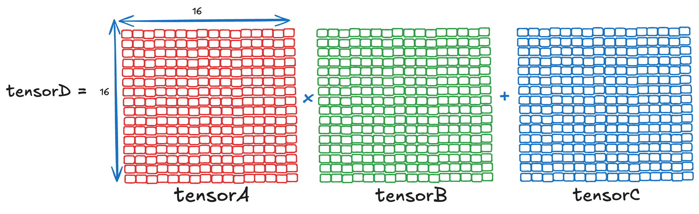
</p>

Tensor operations often use mixed precision: input matrices are represented in a
lower-precision format, such as FP16, while accumulation and output may use a
higher-precision format, such as FP32.

#### But why is this set of operations important?

Matrix-Multiply-Accumulate operations are widely used in many type of
applications,
including AI and LLMs for training and inference, taking more than 80% of the
total
computation for upstream LLMs, as reported
by [Modular](https://www.modular.com/blog/matrix-multiplication-on-nvidias-blackwell-part-1-introduction).
Besides AI and LLMs, matrix-multiply is used for other types of applications
such as scientific computing, graphics and data analytics, just to name a few.

## NVIDIA Tensor Architecture and Native Tensor Performance

In a way, Tensor Cores are equivalent to CPU vector units but for 2D-range
operations, and specifically, for matrix-multiply operations. Thus, in hardware,
GPUs implement a set of functional units to perform multiple MMA operations per
GPU clock cycle. The number of functional units per GPU depends on the GPU
generation the GPU-tier (e.g., a GPU for a data center vs a consumer-grade GPU).
To better understand where tensors are computed on GPUs, let’s look at the
common organization of CUDA cores and Tensors cores on current NVIDIA GPU
architectures.

<p align="center">
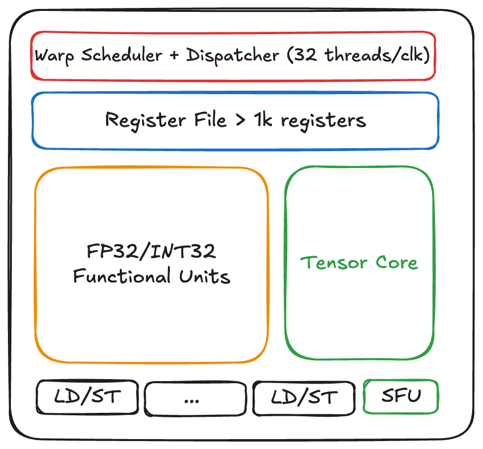
</p>

The diagram represents a processing block from the NVIDIA GPU
architecture. It is composed of a so-called warp-scheduler (a warp on NVIDIA
GPUs means a set of consecutive 32 threads that will run in a lockstep on the
GPU cores). The warp scheduler can dispatch a warp per clock/cycle. **This is
really a throughput machine.**

Each processing block contains a large register file (for example, the NVIDIA
B200 GPU contains more than 16k private registers. This is private space 
for the CUDA threads that run inside the processing block). Furthermore, 
the processing block contains a big set of functional units for computing 
floating point operations in 32-bits, and
integers of 32 bits. These represent the common CUDA cores that NVIDIA
advertise. Each GPU tier and GPU generation varies in the number of CUDA cores
per processing block. For instance, the NVIDIA Blackwell microarchitecture
contains 32 CUDA cores for each processing block.

Additionally, each processing block contains units for performing loads and
stores, and a special functional unit (SFU), in which math operations such as
`sqrt`, `exp`, etc., are processed. From the diagram above we see that SFU unit
is intentionally smaller than the F32/INT32. This represents the fact that the
processing block contains fewer special functional units compared to FP32 (for
multiplications and additions for example).

Finally, **each processing block contains a big unit for explicitly computing
tensors**. The MMA tensor operation that we described previously will be
executed in these units.
NVIDIA GPUs do not provide just one processing blocks per GPU. They are, indeed,
organized into larger processing structures called streaming multiprocessors (
SM). And, in the Blackwell microarchitecture, each SM contains four processing
blocks as follows:

<p align="center">
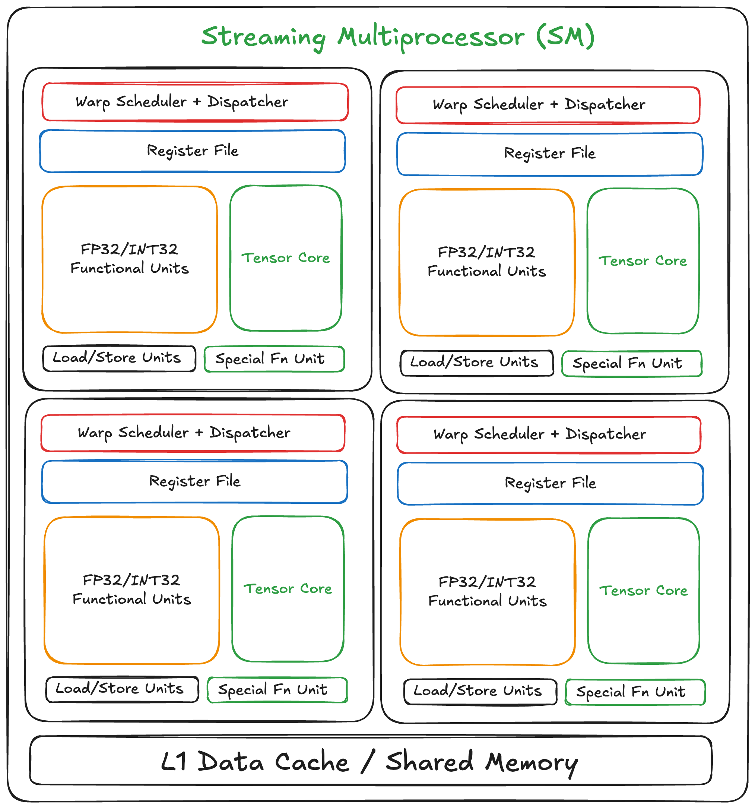
</p>

Different GPU generations and different GPU tiers provide different number of
SMs per GPU. To give you an example,
the [NVIDIA B200 GPU](https://developer.nvidia.com/blog/inside-nvidia-blackwell-ultra-the-chip-powering-the-ai-factory-era/)
contains up to 160 Streaming Multiprocessors (SMs), and each SM contains 4
Tensor Cores.
Furthermore, each Tensor Core can perform up
to [512 FMA operations per cycle](https://cvw.cac.cornell.edu/gpu-architecture/horizon-gpus-blackwell-b200/tensor_cores_fifth_gen)
in half precision (using 16-bits floating point numbers). This gives a **total
of 2048
FMA (Fused Multiply-Add) operations per cycle, per SM!**

**We, as CUDA/GPU programmers, can directly program the Tensor Core Unit via an
API for performing fast MMA operations.**

## How Fast can e Process MMA Operations with Tensor Cores?

Let’s run an experiment. I am going to use an NVIDIA A10 GPU, and the CUDA code
used has been adapted from the following article:
https://developer.nvidia.com/blog/programming-tensor-cores-cuda-9/
The cited article includes a comparison between explicit-use of Tensors using a
naïve version of the matrix-multiplication with the tensor WMMA API, and
compares this version against cuBLAS. While this experiment was written 
for illustration purposes, it gives an idea about how the APIs are used.

I slightly modified that example to also include the naïve matrix multiplication
implemented in CUDA without tensors. This gives a better idea about the
performance gains just by using CUDA Tensors. The source code can be found in
the following link:
https://github.com/jjfumero/cuda-tensor-samples/blob/main/tensorsExample.cu

Thus, now we have 3 versions in this example:

1. A naïve matrix-multiplication implemented in CUDA.
2. A naïve matrix-multiplication implemented in CUDA using the Tensor API (
   wmma) in a column-major layout.
3. A library call to the NVIDIA cuBLAS for GEMM in FP16.

Let’s analyze the performance of each implementation by using
the [NVIDIA Nsight Compute Profiler (NCU)]( https://developer.nvidia.com/nsight-compute).
The following Figure shows a screenshot of the CUDA NCU profiler for each of the
kernels evaluated. What we are interested in the third column (kernel
name), and fifth column (duration in ms) for each of the kernels.

<p align="center">
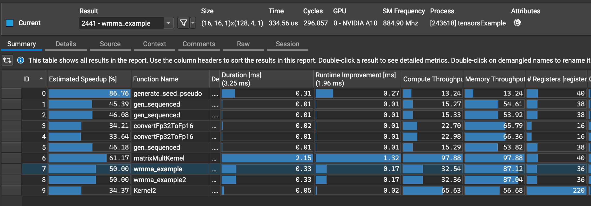
</p>

As we can see, the naïve implementation (illustrated in row 6 from the Figure)
takes 2.15 milliseconds to run a matrix-size of 1024x1024 elements. The naïve
implementation using tensors (`wmma_example`) kernel illustrated in the profiler
report in line 7 takes 0.33 milliseconds. This means a speedup of ~6.5x faster
in kernel time, just by enabling tensor cores!

And how do we know tensors are being used? When we look at the source section of
the NCU profiler, we can identify the `mma` operations from the CUDA source and
correlate with its SSA instructions. The SSA code looks as follows:

```asm
HMMA.16816.F32 R4, R12, R22, R4
HMMA.16816.F32 R8, R12, R24, R8
```

HMMA operations represent tensor core operations, as described in
the [NVIDIA documentation]
(https://docs.nvidia.com/cuda/ampere-tuning-guide/index.html#improved-tensor-core-operations).

From the NCU profiler, we also see that the GEMM kernel from cuBLAS takes 0.05
ms (line 9 in the Figure). Thus, this kernel performs 42x faster than the naïve
matrix multiplication, and 6.5x times faster compared to the naïve version using
Tensor Core operations for this input size on the NVIDIA A10 GPU.

In terms of GFLOP/s, the naïve matmul kernel achieves ~1 TFLOP/s, while the
naïve matmul with tensors enabled performs over 6.5 TFLOP/s and cuBLAS 42 TFLOP/s. 
Note that the performance gap between `wmma` and cuBLAS is expected, since our tensor
version [does not use GPU shared memory, 2D register tiling, or double buffering](https://siboehm.com/articles/22/CUDA-MMM).

## Enabling tensor core programming from Java with HAT and Babylon

Now, the fun stuff. How can we enable Tensor Core Programming from Java? Since
the goal of tensor core programming is to accelerate matrix-multiplications,
let’s start with how the naïve matrix-multiplication (matmul) is expressed in
HAT.

```java
static void mxmNaiveF16(KernelContext kc,
                        F16Array matrixA,
                        F16Array matrixB,
                        F32Array matrixC,
                        int size) {
    float acc = 0.0f;
    for (int k = 0; k < size; k++) {
        F16 ha = matrixA.array(k * size + kc.giy);
        F16 hb = matrixB.array(kc.gix * size + k);
        F16 hc = F16.mul(ha, hb);
        float fc = F16.f16ToFloat(hc);
        acc += fc;
    }
    matrixC.array(kc.gix * size + kc.giy, acc);
}
```

This matmul uses the `F16Array` data type, which is a predefined data type in
the HAT API to operate with arrays of floating point values of 16 bits (
`half-float`).
This kernel is coded using a 2D-Range to access x,y coordinates of the matrix in
parallel and map these thread-ids (namely `kc.gix` and `kc.giy`) with the
corresponding data in the same positions.

To know more about how to optimize the matrix multiplication in HAT, I recommend
the following article:

- [Matrix Multiplication Performance in HAT](https://openjdk.org/projects/babylon/articles/hat-matmul/hat-matmul).

The initial design of the HAT Tensor API was heavily inspired by
the [CUDA Tensor WMMA API](https://docs.nvidia.com/cuda/cuda-c-programming-guide/index.html#wmma),
and we have shaped the API to make it more friendly for Java programmers.

Let's start with how tensor cores can be programmed with CUDA using the WMMA
API.

```c
// Tile using a 2D grid
int warpM = (blockIdx.x * blockDim.x + threadIdx.x) / warpSize;
int warpN = (blockIdx.y * blockDim.y + threadIdx.y);

// Declare the fragments
wmma::fragment<wmma::matrix_a, 
              WMMA_M, WMMA_N, WMMA_K, 
              half, wmma::col_major> a_frag;
wmma::fragment<wmma::matrix_b, 
               WMMA_M, WMMA_N, WMMA_K, 
               half, wmma::col_major> b_frag;
wmma::fragment<wmma::accumulator, 
               WMMA_M, WMMA_N, WMMA_K, 
               float> acc_frag;
wmma::fill_fragment(acc_frag, 0.0f);

// Loop over k
for (int i = 0; i < K; i += WMMA_K) {
  int aRow = warpM * WMMA_M;
  int aCol = i;
  int bRow = i;
  int bCol = warpN * WMMA_N;
 
  // Load the inputs
  wmma::load_matrix_sync(a_frag, a + aRow + aCol * lda, lda);
  wmma::load_matrix_sync(b_frag, b + bRow + bCol * ldb, ldb);

  // Perform the matrix multiplication
  wmma::mma_sync(acc_frag, a_frag, b_frag, acc_frag);
}

// Store the result     
int cRow = warpM * WMMA_M;
int cCol = warpN * WMMA_N;
wmma::store_matrix_sync(c + cRow + cCol * ldc, 
                        acc_frag, ldc, 
                        wmma::mem_col_major);
```

This CUDA C++ API is a low-level API: It uses the `wmma` library, which 
stands for Warp Matrix Multiply Accumulate,
and its operations are performed cooperatively by all threads in a warp.
However, we can use the same core ideas as inspiration for the HAT Tensor API.

The previous code snippet runs a complete matrix multiplication assuming a
16x16x16 WMMA tile and matrix dimensions that are multiples of 16.
Note that CUDA WMMA supports a limited set of tile shapes, with the supported
shapes depending on the operand and accumulator types.
- [NVIDIA Tensor Shapes](https://docs.nvidia.com/cuda/cuda-c-programming-guide/index.html#element-types-and-matrix-sizes)

The overall strategy to compute matrix-multiplication using tensors is as
follows:

```bash
1. Declare Tensor A with specific Shape and Float16 type
2. Declare Tensor B with specific Shape and Float16 type
3. Declare Tensor Accumulator with specific Shape 
4. Initialize the accumulator tensor
5. Loop over the tiles (from 0 to WMMA_K), and for each tile do:
5.1     load tensorA from input matrix A
5.2     load tensorB from input matrix B
5.3     perform mma operation and store in accumulator
6. Store final result in resulting matrix C
```

In CUDA, steps 1 and 2 also declare the access layout for each tensor from
global memory. Furthermore, it tags whether the tensor will be used as 
first operand or second operand.
These are low-level details that we can abstract in HAT.

For the declaration of matrix A or B, we can derive it via runtime analysis
with code-reflection.

For the memory access layout, while we can make it explicit, we can facilitate the accessor
by exposing a default option (row-major) as it is also how Java operates by
default. In case the HAT developer needs to access using column-major layout, we can pass
a new parameter when we define (or load as we will see) the tensor.

Another observation is that the tensors A and B can be directly declare when we
load the data from the input matrices. Besides, when we load, we can specify if we load
into an FP16 tensor via different versions of the load operation.

Thus, we can end-up with the following strategy for HAT:

```bash
1. Initialize the accumulator (e.g., 0.0f)
2. For each of the tiles (from 0 to WMMA_K) do
2.1   load tensorA from matrix A with specified shape
2.2   load tensorB from matrix B with specified shape
2.3   perform mma operation
3. Store final result in matrix C
```

This way of programming is more generic and facilitates code portability
across different programming models and GPU vendors (e.g., by mapping
tensors to explicit tile processing with OpenCL 1.2, as we will see in the
next section).

Note that WMMA fragments in CUDA are mutable objects. However, in our model,
we assume tensors are immutable, at least at the API level in HAT.
While this eases programmability, the HAT runtime and compiler are still free to
reorganize those operations to better match the underlying programming model
(e.g., CUDA and OpenCL). As follows, we will explain the details of how HAT
exposes these operations for Java programmers. 

### 1. Declare Tensor Accumulator in HAT

Tensor operations are defined in the `Tensor` class in HAT.
The following code snippet shows how to create a tensor already initialized to
`zeros`. Besides, it defines a common shape object to be used for the 
accumulator and load operations.

```java
final int sizeShape = 16;
// We can share a shape
var shape = Tensor.shape(sizeShape, sizeShape, sizeShape);
Tensor acc = Tensor.zeros(shape, float.class);
```

### 2. For each of the tiles (from 0 to WMMA_K) 

Each thread iterates over the tiles, in this case `WMMA_K`.
Then, for each tile what we need to do is to load the input data in tensors and
perform the mma
operation.

```java
for (int i = 0; i < size; i += WMMA_K){
   // load tensors
   // perform mma
}
```

### 2.1 Load tensorA from matrix A with specified shape

To load a tensor, we use the `loadF16` method from the `Tensor` class.
The parameters are defined as follows:
- Input matrix.
- Row to load
- Column to load
- Leading dimension
- Shape

```java
Tensor tensorA = Tensor.loadF16(matrixA, aRow, i, lda, shape);
```

If we do not specify the memory access layout, the HAT runtime and compiler will
use row-major by default. Otherwise, we can pass an accessor as follows:

```java
Tensor tensorA = Tensor.loadF16(matrixA, aRow, i, lda, shape,
        Tensor.ofColumnMajor());
```

### 2.2 Load tensorB from matrix B with specified shape

Similarly, we load the data from the second matrix into tensor B.

```java
Tensor tensorB = Tensor.loadF16(matrixB, i, bCol, ldb, shape);
```

### 2.3 Perform the MMA Operation

Now we have everything ready to perform the MMA operation.

```java
acc = Tensor.mma(tensorA, tensorB, acc);
```

This operation performs `acc = tensorA * tensorB + acc`. If we run this code
on a platform with tensor-core processing support, the HAT compiler maps 
these instructions to explicit `mma` tensor core instructions.
Otherwise, as we will see in the following sections, the HAT compiler maps
this operation into an explicit tile operation to perform an explicit mma
operation as follows:

```java
acc = add(dot(tensorA, tensorB, acc);
```

### 3. Store final result in matrix C

```java
Tensor.store(matrixC, cRow, cCol, acc, ldc);
```

### Complete Kernel Code in HAT

```java

@Reflect
public static void mxmTensor(@RO KernelContext kc,
                             @RO F16Array matrixA,
                             @RO F16Array matrixB,
                             @WO F32Array matrixC,
                             int size) {
    final int SHAPE = 16;
    final int WMMA_M = SHAPE;
    final int WMMA_N = SHAPE;
    final int WMMA_K = SHAPE;

    int warpM = kc.gix / kc.wrs;
    int warpN = kc.giy;

    var shape = Tensor.shape(WMMA_M, WMMA_N, WMMA_K);
    Tensor acc = Tensor.zeros(shape, float.class);
    for (int i = 0; i < size; i += WMMA_K) {
        int aRow = warpM * WMMA_M;
        int aCol = i;
        int bRow = i;
        int bCol = warpN * WMMA_N;
        if (aRow < lda && aCol < lda && bRow < ldb && bCol < ldb) {
            Tensor tensorA = Tensor.loadF16(matrixA, aRow,
                    aCol, lda, shape);
            Tensor tensorB = Tensor.loadF16(matrixB, bRow,
                    bCol, ldb, shape);
            acc = Tensor.mma(tensorA, tensorB, acc);
        }
    }
    int cRow = warpM * WMMA_M;
    int cCol = warpN * WMMA_N;
    Tensor.store(matrixC, cRow, cCol, acc, ldc);
}
```

And, if we emit the generated CUDA code by the HAT compiler, we obtain
the following CUDA C++ kernel:

```java
HAT_KERNEL

void testTensor(
        HAT_GLOBAL_MEM KernelContext_t*kc,
        HAT_GLOBAL_MEM F16Array_t*matrixA,
        HAT_GLOBAL_MEM F16Array_t*matrixB,
        HAT_GLOBAL_MEM F32Array_t*matrixC,
        int size
) {
    int SHAPE = 16;
    int WMMA_M = SHAPE;
    int WMMA_N = SHAPE;
    int WMMA_K = SHAPE;
    int warpM = HAT_GIX / 32;
    int warpN = HAT_GIY;
    int lda = 1024;
    int ldb = 1024;
    int ldc = 1024;
    nvcuda::wmma::fragment <
            nvcuda::wmma::accumulator, 16, 16, 16,float>acc;
    nvcuda::wmma::fill_fragment(acc, 0.0);
    nvcuda::wmma::fragment <
            nvcuda::wmma::matrix_a, 16, 16, 16, half,
            nvcuda::wmma::col_major > tensorA;
    nvcuda::wmma::fragment <
            nvcuda::wmma::matrix_b, 16, 16, 16,
            half, nvcuda::wmma::col_major > tensorB;
    for (int i = 0; i < size; i = i + WMMA_K) {
        int aRow = warpM * WMMA_M;
        int aCol = i;
        int bRow = i;
        int bCol = warpN * WMMA_N;
        if (aRow < lda && aCol < lda && bRow < ldb && bCol < ldb) {
            nvcuda::wmma::load_matrix_sync(
                    tensorA,
                    (half *)matrixA -> array + aRow + (aCol * lda),
                    lda);
            nvcuda::wmma::load_matrix_sync(
                    tensorB,
                    (half *)matrixB -> array + bRow + (bCol * ldb),
                    ldb);
            nvcuda::wmma::mma_sync(acc, tensorA, tensorB, acc);
        }
    }
    int cRow = warpM * WMMA_M;
    int cCol = warpN * WMMA_N;
    nvcuda::wmma::store_matrix_sync(
            matrixC -> array + cRow + (cCol * ldc),
            acc, ldc,
            nvcuda::wmma::mem_col_major);
    return;
}
```

As we can see, the generated kernel from the HAT JIT compiler for CUDA
is extremely similar to the hand-written CUDA kernels for tensors.

If readers want to play with the HAT tensor API, it is fully available on GitHub
under the `hat/tensors/v2` branch.

- [HAT Tensor Support](https://github.com/jjfumero/babylon/tree/hat/tensors/v2):
  yes, we have iterated this API a couple of times already ;-).

Before we show the performance impact of this API from the Java/HAT level,
there is another component in the API that we haven't described it yet, the
warp-size and how to launch the kernel on the GPU. Let's now describe it
and analyze how we can make it portable across different programming models.

## Enabling Tile and Warp Sizes from the HAT ND-Range API

As we have discussed, programming tensor cores through the CUDA software stack
is enabled via the WMMA (warp-matrix-multiply-accumulate API). As explained in
the NVIDIA GPU architecture section, recall that a warp is basic group of
execution unit composed of a set of 32 consecutive threads in a lockstep.

Tensor operations described in this article are executed per warp. Each warp
performs, for example, a 16x16 MMA operation, in the case of running with same
shape (16x16). However, since each warp performs an MMA operation of the desired
shape, we need to recalculate the total number of threads to launch.

Furthermore, each GPU vendor may have a different warp size (e.g., on AMD GPUs,
a wavefront – equivalent of warp using the AMD terminology) is composed of a set
of 64 threads. However, if we want to make this code portable across vendors and
different heterogeneous programming models we should not
change any line of code to be able to run the application and still obtain correct
results. Thus, we need to design the thread-dispatcher and warp assignment
carefully within the HAT runtime.

#### How do we tackle the runtime portability for Warps and Tiles?

Currently, HAT exposes an API to specify the global size and local work-group
size through the ND-Range API. We extended the ND-Range API to also include
a tile-size, and warp sizes and modified the HAT runtime to make warps 
portable.

By portability, we mean that the generated kernel along with the runtime
scheduling parameters must be functionally correct across the supported platforms. 
We will have the opportunity to tune the ND-range to our needs for the current 
deployments, but this should not be an obstacle to obtain correct functionality.

Introducing a warp-size construct in the HAT API that can change value at
runtime affects how to define the total number of threads
to be deployed using the ND-Range API in HAT.

For instance, a simple 2D ND-range is defined as follows:

```java
NDRange range = NDRange.of2D(ofGlobal(1024, 1024),
        ofLocal(16, 16));
```

This means that we want to launch groups of threads of 16x16 in a total mesh of
threads of 1024x1024. This follows the OpenCL semantics. However, the equivalent
scheduler following the CUDA semantics is recalculated as follows:

```java
var range = Grid(64, 64), Block(16,16);
```

Thus, the nd-range is recomputed with a grid of threads of
64x64 using the same block size (16x16). Keep in mind that this is automatically
handled by the HAT runtime without developer's feedback.

### Introducing Warp-Size and Tile-Size in the ND-Range API

By introducing warps and tiles what we are doing is reducing
the total number of threads to be deployed, while increasing the work to be done
per thread. With the new extension, we can make this visible as follows:

```java
              // total number of threads        
var ndRange = NDRange2D.of(Global2D.of(1024, 1024),
        // Local work-group sizes
        Local2D.of(128, 4),
        // our tile (shape) size
        NDRange.Tile2D.of(16, 16),
        // indicate warp-enabled per dimension
        Warp2D.of(true, false));      
```

Thus, for a given nd-range, the thread-dispatcher is recalculated as follows:

For the OpenCL backend:

```bash
ndRange = [ (size / tileSize), (size / tileSize) ]
```

For the CUDA backend:

```bash
ndRange = [ ((size / tileSize) * warpSize), (size / tileSize) ]
```

This convention may not cover every possible scheduling strategy,
but it gives HAT a portable default that launches the correct number of threads
for each backend without requiring source-code changes, thus, achieving
functional portability.

But how is the `warp-size` recalculated? In this case, the value of the
warp-size coded in HAT kernel is automatically calculated and inserted
directly into the tree of the original code model. Currently, this
is implemented as a new `Op` that is contained in dialect for tensors
within the HAT code transformer.

A dialect is a domain specific code model without modifying the core 
Java code models. It can be seen as an extension for a specific 
domain of applications, in our case, for tensors. 

A detailed discussion of tensor dialects is beyond the scope of 
this article; however, we may cover this topic in a dedicated 
article in the future.

Thus, for instance, for the following kernel code that access
the warp size:

```java
int warpM = kc.gix / kc.wrs; // warp-size usage 1st dim
int warpN = kc.giy;
```

the `kc.wrs` becomes a constant value of 32 during code specialization when
compiling for NVIDIA architectures. In the case of OpenCL, we might choose
a value of 1, or any other value that matches the current architecture in which
the kernel will be deployed.

## Enabling Compiler and Runtime Device Portability for HAT

HAT maps its Tensor API to explicit tensor operations when using the CUDA
backend via the WMMA API. However, as mentioned before, the WMMA API is specific
to the CUDA programming model and NVIDIA GPUs. But, how do we make it portable then?
Our objective with HAT is not to define vendor-specific interfaces, but rather
to provide abstractions that can be mapped to different architecture, hardware
accelerators and programming models.

To enable functional portability, we represent tensors as tiles. Tensor
operations are represented as tile-level operations for the creation, loading,
storing and computing math operations such as the MMA.
Readers with OpenCL experience might think of OpenCL subgroups, that can be used
to target tensor operations, such as for Intel extensions for subgroups:

- [Intel OpenCL MMA](https://registry.khronos.org/OpenCL/extensions/intel/cl_intel_subgroup_split_matrix_multiply_accumulate.html).
- [Intel OpenCL Subgroups](https://registry.khronos.org/OpenCL/extensions/intel/cl_intel_subgroups.html)

While this is a possible and a promising way to match tensor operations to other
hardware, what we want initially is to keep a generic reference implementation in which
we can guarantee that we can run the corresponding HAT programs with older
hardware/support for OpenCL (e.g., OpenCL subgroups were promoted to core in
OpenCL 2.1, but platforms such as MacOS and Apple Silicon only support OpenCL 1.2).
Note that OpenCL extensions may expose subgroups, even for older OpenCL
versions. However, this is not the case of Apple OpenCL.

As such, a tensor load operation:

```java
var tensorA = Tensor.load(matrixA, aRow, aCol, lda);
```

can be offloaded to the following code using loop tiles:

```c
int aRow = warpM * WMMA_M;
for (int m = 0; m < WMMA_M; m++) {
    int rowA = aRow + m;
    for (int n = 0; n < WMMA_N; n++) {
        int colA = aCol + n;
        int idxA = rowA + colA * lda;
        HAT_GLOBAL_MEM F16Impl_t* ha = &matrixA->array[idxA];
        F16_t r = (F16_t){ha->value};
        a_frag[m * WMMA_M + n] = r;
    }
}
```

The `store` operation is processed similarly:

```c
for (int m = 0; m < WMMA_M; m++) {
    int rowC = cRow + m;
    for (int n = 0; n < WMMA_N; n++) {
        int colC = cCol + n;
        int idxC = rowC + colC * ldc;
        matrixC->array[idxC] = acc[m][n];
    }
}
```

The `mma` operation is mapped as follows:

```c
for (int m = 0; m < TILE_SIZE_M; m++) {
    for (int n = 0; n < TILE_SIZE_N; n++) {
        float sum = acc[m][n];
        for (int k = 0; k < WMMA_K; k++) {
            F16_t ha = a_frag[m * TILE_SIZE_M + k];
            F16_t hb = b_frag[k * TILE_SIZE_N + n];
            F16_t result = (F16_t){(ha.value * hb.value)};
            sum += (float)(result.value);
        }
        acc[m][n] = sum;
    }
}
```

The `tensor` and `accumulator` arrays are mapped to the accelerator’s private
memory. Each accelerator thread processes a small tile: it loads tiles from 
global memory into private memory, performs the MMA operation locally, and 
stores the resulting tile back to global memory.

The next question is how does HAT perform for the CUDA backend targeting CUDA 
Tensors as well as an OpenCL backend for processing tensor operation as tiles? 
The following section tackles performance evaluation of this approach.

## Performance Evaluation

To evaluate the tensors support with HAT we use two different platforms to
check performance and portability for the two available backends in HAT.
Namely:

1. An NVIDIA A10 GPU with programmable tensor cores.
2. Apple M4 Max GPU with OpenCL 1.2: this platform does not provide explicit
   tensor support via the OpenCL 1.2 software stack, and it is used to check
   code portability, functionality and performance by mapping to explicit tile
   processing for tensors.

The following table summarizes the main hardware and software components for
each platform:

| HW/SW Component       | NVIDIA A10 (24GB VRAM)                                                                                                    | Apple M4 Max Laptop                                                                                                       |
|-----------------------|---------------------------------------------------------------------------------------------------------------------------|---------------------------------------------------------------------------------------------------------------------------|
| GPU                   | NVIDIA A10                                                                                                                | Apple M4 Max GPU                                                                                                          |
| Programming Backend   | CUDA 13.2.78                                                                                                              | OpenCL 1.2                                                                                                                |
| Driver Version        | 595.71.05.                                                                                                                | Apple OpenCL 1.2 1.0                                                                                                      |
| System Memory         | 235 GB                                                                                                                    | 64 GB                                                                                                                     |
| CPU                   | Intel Xeon Platinum 8358 CPU @ 2.60GHz                                                                                    | Apple M4 Max                                                                                                              |
| Operating System      | Ubuntu 22.04.5 - 6.8.0-1052-oracle                                                                                        | macOS 26.3.1                                                                                                              |
| Java Version          | 26-ea+10-1053.                                                                                                            | 26+35-2893                                                                                                                |
| Babylon Revision      | b54f01cdbe1.                                                                                                              | b54f01cdbe1                                                                                                               |
| HAT Backend           | CUDA                                                                                                                      | OpenCL                                                                                                                    |
| Benchmark Application | [Main.java](https://github.com/jjfumero/babylon/blob/hat/tensors/v2/hat/examples/tensors/src/main/java/tensors/Main.java) | [Main.java](https://github.com/jjfumero/babylon/blob/hat/tensors/v2/hat/examples/tensors/src/main/java/tensors/Main.java) |
| Input Sizes           | 512 to 4096                                                                                                               | 512 to 4096                                                                                                               |
| Java Heap Size        | 16 GB                                                                                                                     | 16 GB                                                                                                                     |

Note that the GPU A10 is running in an instance from Oracle Cloud (OCI).
The instance is a paravirtualzed VM with 15 CPU cores assigned.

The versions to be compared are: a) the Java parallel-streams running on the
corresponding CPU system; b) the Java/HAT naïve matrix multiplication using
FP32 (float) values; c) the Java/HAT naïve matrix multiplication using FP16 (
half) values, and d) the naïve matrix multiply implemented using the proposed
Tensor API for HAT.

We run each benchmark 100 times and collected the last 50 runs for the report.
Furthermore, we set the Java heap size to 16GB. We also run the benchmark for
four different sizes, ranging from 512x512 matrices to 4kx4k matrices. The
following code snippet shows how this benchmark has been evaluated:

```bash
backend="ffi-opencl"
timestamp=`date "+%a-%b-%d-%I-%M-%S-%p-%Y"`
directory="tensorResults_$timestamp"
mkdir -p $directory

inputSize=(512 1024 2048 4096)
for s in ${inputSize[@]}; do
    echo -e "Running with MatMul Tensors with Size: $s x $s"
    java -Xmx16g -Xms16g -cp hat/job.jar hat.java run \
          $backend tensors --size=$s --iterations=100 \
          --verbose --skip-sequential > $directory/$s.log
    sleep 10
done
```

## Performance of HAT with Tensors on NVIDIA A10 GPU

This section shows how HAT performs when explicit tensor cores are used in
hardware via the CUDA backend. The following performance graph shows the
speedups of each version, namely naïve matrix multiplication in FP32 and FP16
respectively, and the naïve matrix multiplication implemented using the HAT
Tensor API. All these versions are compared to the Java parallel stream
implementation evaluated on the Intel Xeon Platinum 8358 with 16 CPU cores.
Furthermore, the following performance graph reports end-to-end time in peak
performance (after warmup), including data transfers (copy data from the CPU to
the GPU, matrix-multiplication processing, and copy data from the GPU to the
CPU).

<p align="center">
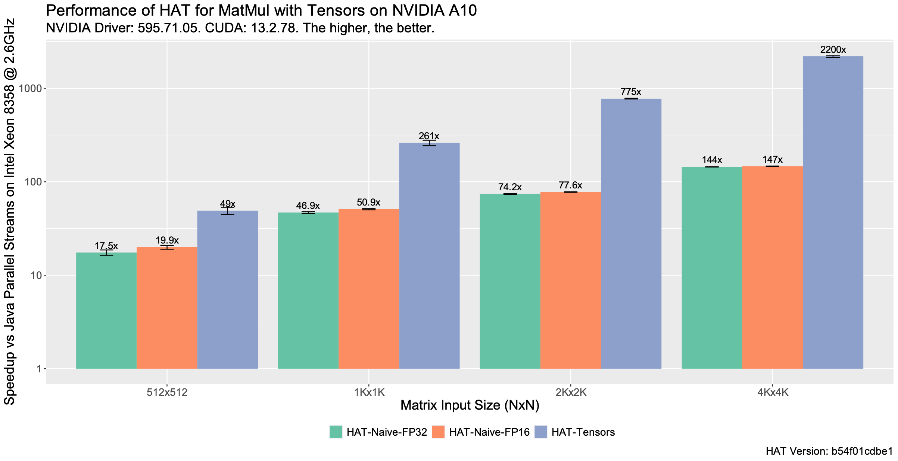
</p>


We can see that the HAT tensor implementation performs up to 2200 times faster
compared to Java Parallel streams running on the Intel Xeon Platinum (16 cores),
and it is consistently faster for all data points compared to the naïve
implementations in FP16 and FP32 respectively.

## Kernel Performance Profiled with NCU

The previous performance graph showed the end-to-end time, including data
transfers, GPU kernel execution and the HAT runtime. However, we also want to
analyze if our kernel tensor implementation in HAT matches performance with the
handwritten CUDA C++ kernel using the WMMA API.
Ideally, the kernel performance of these two (CUDA code generated by HAT and the
CUDA WMMA native version) should match.

To check this, we evaluated the HAT execution with the NCU kernel profiler and
obtain the GPU kernel elapsed time.

The following Figure shows a screenshot of the NCU profiler when running the
Tensor benchmark with the same input size (1024x1024) used for the initial
evaluation of the CUDA C++ versions.

<p align="center">
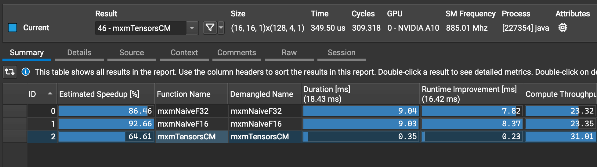
</p>

As we can see, the `mxmTensorCM` kernel takes ~0.35 ms, which is 4% slower
compared to the CUDA C++ WMMA kernel implementation for this data type that we
saw in Figure 1.

### But why doesn’t it run at the same speed as CUDA Native?

The HAT compiler transforms arrays represented with Java interfaces into
C99-structs. With this in mind, let’s inspect the profiler of both kernels (CUDA
C++ and the one generated by HAT) in more detail.

At a first glance with the *SoL* (the Speed of Light) section of the NCU, we see
the following differences. The diagram shows the compute-throughput and memory
throughput for both kernels. The green bar represents the baseline (CUDA C++),
while the blue line represents the throughput of the CUDA kernel generated by
HAT.

As we can see, the compute-throughput in the case of the HAT kernel is 4.47%
slower compared to the equivalent CUDA C++ version.

<p align="center">
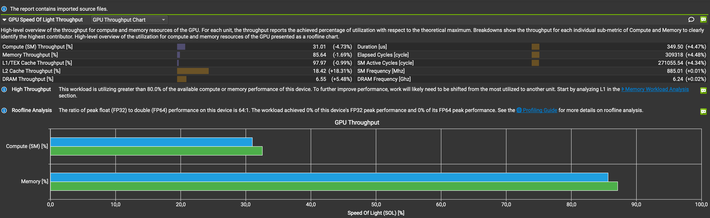
</p>

Looking at the memory subsystem report, we see the following values:

<p align="center">
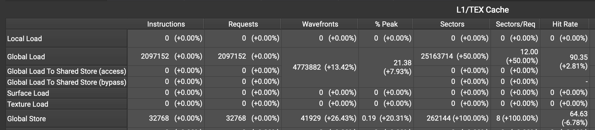
</p>

Keeping the CUDA WMMA C++ as baseline against the generated CUDA code from HAT,
we see a large increase in memory sectors (+50% increase by
looking at the row “Global Load” and column “Sectors”). Besides that, we see
a 50% increase regarding the memory sectors per request, which increases the
memory traffic between the L2 and the global memory, producing slower
overall kernel executions.

The main reason for this seems to be related with memory alignment. Looking
at [the NVIDIA documentation for tensor loads/stores](https://docs.nvidia.com/cuda/cuda-c-programming-guide/index.html#wmma-description)
we find the following description:

> Waits until all warp lanes have arrived at load_matrix_sync and then loads the
> matrix fragment a from memory. `mptr` must be a 256-bit aligned pointer
> pointing to the first element of the matrix in memory.


This means we need 32-byte alignment for the inputs F16Array arrays.

```diff
--- a/hat/core/src/main/java/hat/buffer/F16Array.java
+++ b/hat/core/src/main/java/hat/buffer/F16Array.java
@@ -41,6 +41,7 @@ interface F16Impl extends Struct, F16 {
 
   Schema<F16Array> schema = Schema.of(F16Array.class, f16array ->
           f16array.arrayLen("length") // 4 bytes for length
+             .pad(28)  // + 28 bytes for padding -> 32 bytes
              .array("array",
                      half -> half.fields("value")));
```

After applying the alignment, we now obtain the following SoL report:

<p align="center">

</p>

The green line represents the baseline (CUDA C++ kernel) and the blue line
represents the kernel generated by HAT for both compute and memory throughput.
The main difference compared to the previous version is in the compute section,
that now runs 0.85% slower, producing equivalent CUDA kernels.

If we benchmark the different versions and input sizes with the NCU, we can
compare the kernel quality across the different versions. The following Figure
shows the GFLOP/s (the higher, the better) for each version, including the CUDA 
C++ WMMA and cuBLAS versions. In this case, the HAT version for tensors does 
not include alignment.

<p align="center">
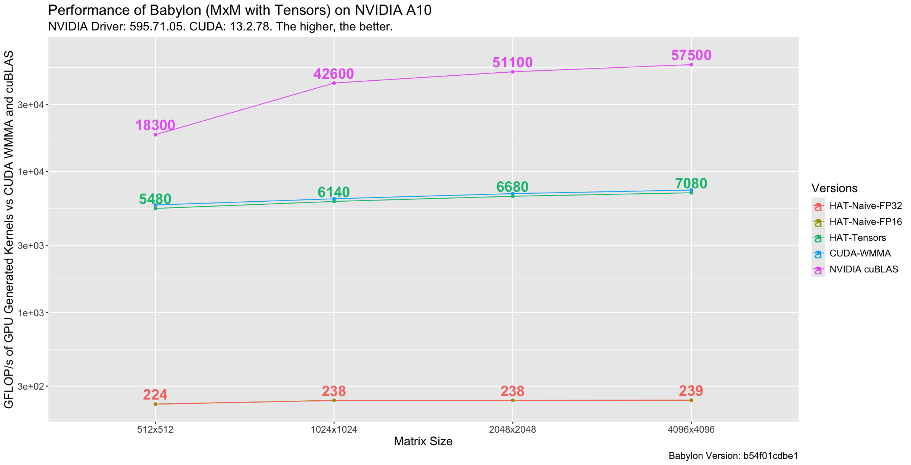
</p>

As we can see, the HAT Tensor generated kernel achieves up to 7.0 TFLOP/s, while
the 2D naïve implementations achieve 239 GFLOP/s.

The following performance plot shows the performance when the data alignment is
set to 32 bytes for the input F16Array types.

<p align="center">
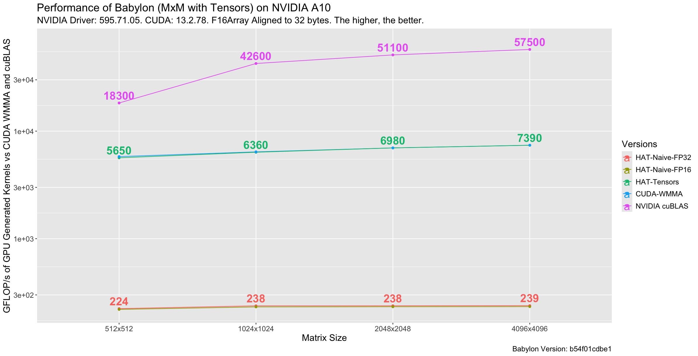
</p>

As we can see, HAT achieves up to 7.4 TFLOP/s. The CUDA C++ and the HAT
generated tensor kernel achieve, in this case, the same performance, as we
discussed earlier. The highest performance is achieved when running the CUDA
cuBLAS version, by a factor of 3-7x faster. However, let’s keep in mind that the
cuBLAS implementation has been optimized, while our initial version with tensor
still has plenty of room for improvements.

### Performance on Apple M4 Max GPU with OpenCL 1.2 and Explicit Tiles

The following performance plot shows the speedups of each version compared to
the Java Parallel Streams evaluated on the CPU (the higher, the better). The
x-axis shows the input data size (matrix sizes), and the y-axis shows the
speedup. For this version, we use a default value of a local group size
(`Local.of` from the HAT API) of 128x4 threads, and a tile size of 16 elements.
We initially choose these values as they were the default ones when running with
the CUDA backend.

<p align="center">
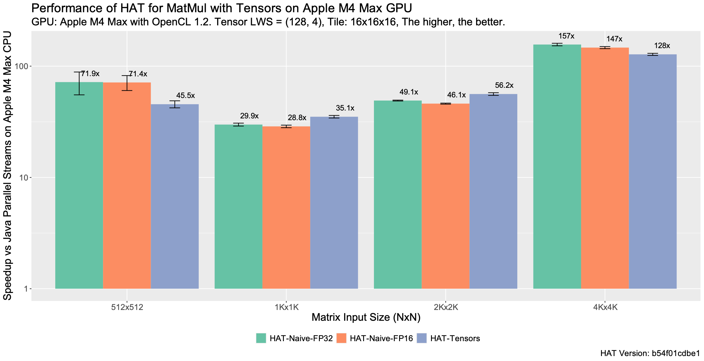
</p>

Using explicit tile processing does not automatically improve performance.
In this experiment, the tensor version improves performance for the 1k and 2k
matrix sizes,
but it is slower than the naïve matrix multiplication for the smallest and
largest sizes, and slightly faster for the rest of the input sizes.

But, why is it slower? One important performance factor to keep in mind when
running applications on GPUs is the selection of the group size and the 
tile size. This can influence performance, even if the application is 
suitable for acceleration.

Thus, what we might need to do on many occasions is to tune the group size and
tile size. The following code snippet shows the parameters tuned for this
application. Note that other combinations may also improve performance,
and if the reader tries on another GPU, quite likely,
these parameters need to be tuned again.

```diff
--- a/hat/examples/tensors/src/main/java/tensors/Main.java
+++ b/hat/examples/tensors/src/main/java/tensors/Main.java
@@ -67,7 +67,7 @@ public class Main {
-        final int shapeSize = 16;
+        final int shapeSize = 4;
-                Local2D.of(128, 4),
-                NDRange.Tile2D.of(16, 16),
+                Local2D.of(128, 1),
+                NDRange.Tile2D.of(4, 4),
```

By selecting a tile size of 4x4 elements and a group size of 128x1 threads, we
obtain the following performance graph:

<p align="center">
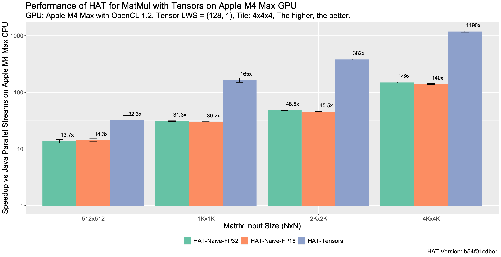
</p>

With these parameters, the automatic loop-tiled implementation improves by up to
9x compared to the previous configuration. It becomes the fastest version across 
all evaluated input sizes and reaches more than 1000x speedup over the CPU 
parallel-stream implementation. The results were also validated for correctness.

The main takeaway is that the HAT compiler and runtime can compile and launch an
equivalent application by mapping tensors to explicit tiles, and with some
parameter tuning, we can obtain performance even for non-supported tensor
devices. This is due to the applicability of thread-coarsening for this
compute-kernel and the increasing work per thread compared to the naïve matrix
multiplication.

## Conclusions

In this article, we have explained how to enable Tensor Core computation for
NVIDIA GPUs from Java using the Project Babylon and HAT. Furthermore, we have
explained how to make the proposed representation portable across different
backends, by explicitly computing tensors as tiles, given the option to execute
tensors with different shapes using programming models and accelerators that
lack of such execution units for matrix-multiply and accumulate accelerations.

We have shown the performance that is possible to achieve on an NVIDIA A10
and on Apple M4 Max GPUs. For the NVIDIA platform, we showed that the
performance matches with the equivalent CUDA C++ execution, achieving up to 7.3
TFLOP/s for the naïve matrix multiplication expressed with the HAT Tensor API,
matching the performance with its equivalent CUDA C++ implementation.

Furthermore, we have shown that, with a bit of tuning, performance of the whole
application improves by 9x compared to the execution of the kernel without the
Tensor API enabled.

The main conclusion is that with the Project Babylon and code reflection, it is
possible to model portable Java applications to target hardware accelerators
while achieving high performance.

While this article has been focused on the acceleration of the matrix
multiplication application via the tensor cores, prior works demonstrate that
tensor cores programming can be also applied to a wider class of computations,
including [reductions](https://ieeexplore.ieee.org/document/9147055)
and [Graph Convolutional Networks (GCNs)](https://dl.acm.org/doi/10.1145/3629526.3653835).

## Appendix

The Tensor API implementation for HAT is fully available on GitHub:

- [GitHub Branch](https://github.com/jjfumero/babylon/tree/hat/tensors/v2)

### How to run the Java Benchmark

```bash
java @hat/run ffi-opencl tensors --iterations=100 --verbose --size=1024 --check
```

### Show Performance Numbers

The benchmark stores a csv table in the local directory:

```bash
cat table-tensors-1024.csv
```

### Show the Generated Code

```bash
HAT=SHOW_CODE java @hat/run ffi-opencl tensors --iterations=100 --verbose --size=1024 --check
```
